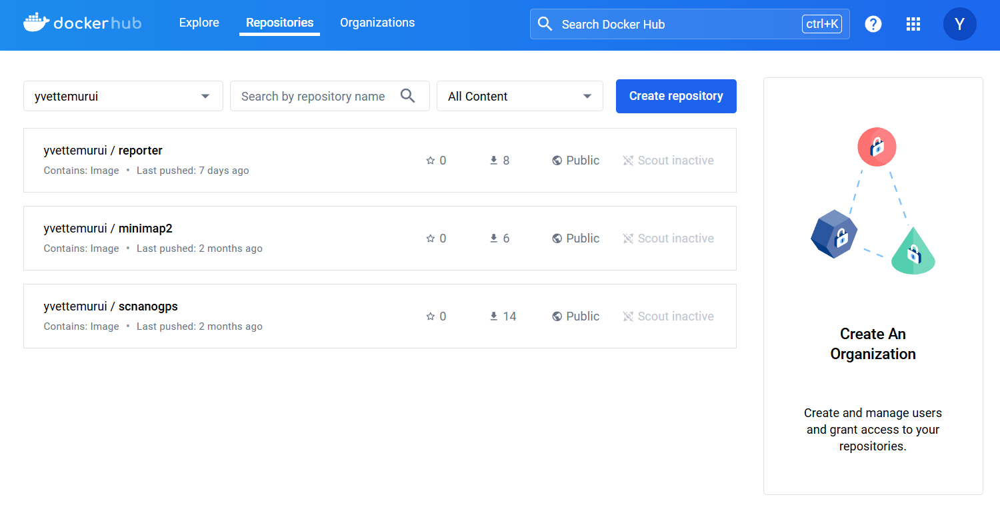

# Singularity Guidance

___

- [Singularity Guidance](#singularity-guidance)
  - [Introduction](#introduction)
    - [:mortar\_board: What is Singularity](#mortar_board-what-is-singularity)
    - [:postbox: Why use containers](#postbox-why-use-containers)
    - [:sparkles: Why use Singularity](#sparkles-why-use-singularity)
    - [:books: User manual](#books-user-manual)
  - [Quick Start](#quick-start)
    - [:cd: Build an image from Dockerfile](#cd-build-an-image-from-dockerfile)
    - [:whale: Push an image to Docker Hub](#whale-push-an-image-to-docker-hub)
    - [:gift: Create a container from an image](#gift-create-a-container-from-an-image)
    - [:sparkler: Execute commands in a container](#sparkler-execute-commands-in-a-container)
      - [Method 1: `exec` command](#method-1-exec-command)
      - [Method 2: `shell` command](#method-2-shell-command)

___

## Introduction

### :mortar_board: What is Singularity

Singularity is a *container* platform. It allows you to create and run containers that package up pieces of software in a way that is portable and reproducible.

**Main concepts:**

| Concepts          | Descriptions |
| ----------------- | ------------ |
| Image (镜像)      | An image is a **read-only** special file system that provides everything a container needs to run: programs, libraries, resources, configurations, and more.<br><br>You can think of an image as a **snapshot** of an operating system. |
| Container  (容器) | A container is a **instance** of an image, which means that it is **writable**. You can run multiple containers from the same image, and they are isolated from each other.<br><br>Containers can be created, started, stopped and deleted, and share the host operating system kernel but have their own isolated filesystems and (sub)processes.<br><br>Essentially, a started container is a **process** running on your host operating system. |
| Repository (仓库) | A repository is a **storage location for images**. Repositories can be public (accessible by anyone) or private (restricted to specific users or organizations).<br><br>The most common repository is **Docker Hub**, which hosts a large number of **official images**. (Although Singularity also has its cloud library, we usually do not use it.)<br><br>Typically, a repository contains different versions (tags) of the same image. You can specify a specific version of an image using the format `<repository-name>:<tag>`. If no tag is provided, it defaults to `latest`. |

<br>

> <center>An image is <i>still</i>, while a container is <i>alive</i>.</center>

<br>

### :postbox: Why use containers

Containers provide a reliable way to maintain consistent application performance across various environments. They encapsulate the application's source code, environment settings, and third-party dependencies into a single image. This image can be used to create containers that run uniformly, regardless of the underlying environment. This approach mitigates issues that arise from discrepancies in environments, configurations, and dependency versions, facilitating seamless cross-platform and cross-server operations and streamlining the transition from development to deployment.

### :sparkles: Why use Singularity

Singularity is an open source container platform designed to be simple, fast, and secure. **Unlike Docker which requires root privileges to run containers**, Singularity is designed for ease-of-use on shared multi-user systems and in high performance computing (HPC) environments. **Singularity is compatible with all Docker images** and it can be used with GPUs and MPI applications.

### :books: User manual

The latest version of Singularity User Guide is always available through the url: https://docs.sylabs.io/guides/latest/user-guide/

___

## Quick Start

> Note: Before we start, please make sure that you had installed `docker` and registered an account of Docker Hub. As for how to write a Dockerfile, please check the examples in [another github repository](https://github.com/cuhk-haosun/workshop-docker/tree/main).

### :cd: Build an image from Dockerfile

```bash
docker build [OPTIONS] PATH
```

Options used often:

```
-f, --file string                   Name of the Dockerfile (default:
                                      "PATH/Dockerfile")
-t, --tag stringArray               Name and optionally a tag (format:
                                      "name:tag")
```

Supposed that you were already in the directory that had everything necessary for your Dockerfile, you could execute this command to build an image with specified name and tag.

```bash
docker build -t <repository-name>:<tag> .
```

> :exclamation: Note: Because later we need to push this image to Docker Hub, please use `<repository-name>` as the full name of your image, which in fact is the path to your Docker Hub repository and usually looks like this: `<username>/<image-name>`, where `<username>` is your username in Docker Hub.

For example:

```bash
docker build -t QiYifang/minimap2:v1 .
```

After that, you can use `docker images` to list all of the images in your computer.

```bash
runoob@runoob:~$ docker images
REPOSITORY              TAG                 IMAGE ID            CREATED             SIZE
mymysql                 v1                  37af1236adef        5 minutes ago       329 MB
runoob/ubuntu           v4                  1c06aa18edee        2 days ago          142.1 MB
<none>                  <none>              5c6e1090e771        2 days ago          165.9 MB
httpd                   latest              ed38aaffef30        11 days ago         195.1 MB
php                     5.6-fpm             025041cd3aa5        3 weeks ago         456.3 MB
python                  3.5                 045767ddf24a        3 weeks ago         684.1 MB
...
```

> Note: It is accessible for us to modify the name and tag of an image by the command `docker tag <IMAGE ID> <new-name>:<new-tag>`.

### :whale: Push an image to Docker Hub

It is very convenient to push your image to Docker Hub:

```bash
docker push <repository-name>:<tag>
```

When it is done, you can check your image at Docker Hub website.



### :gift: Create a container from an image

To pull an image from Docker Hub and build it into a **sandbox (container in a directory)** in NGS cluster, use the `build --sandbox` command and option:

```bash
singularity build --sandbox </path/container-name> docker://<repository-name>:<tag>
```

This command creates a container in a directory with an isolated Linux filesystem and some Singularity metadata.

> :exclamation: Note: Don't forget to add the `--sandbox` option. Otherwise, Singularity may only pull and build an SIF image, which causes the computing nodes at NGS cluster failed to run it owing to their lack of certain software for converting SIF images into containers.

### :sparkler: Execute commands in a container

#### Method 1: `exec` command

The `exec` command allows you to execute a custom command within a container.

```bash
$ singularity exec </path/container-name> echo hello
hello
```

If you pass the `--writable` option, you can also write files within the sandbox directory.

```bash
$ singularity exec --writable </path/container-name> touch /foo

$ singularity exec </path/container-name> ls /foo
/foo
```

#### Method 2: `shell` command

The `shell` command allows you to spawn a new shell within your container and **interact with it** as though it were a virtual machine (And it is writable).

```bash
$ singularity shell </path/container-name>
Singularity>
```
