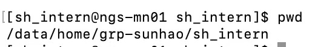
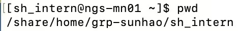

# Checklist for Newcomers of Sublab

***

## Register a Github Account
- Pls refer to https://docs.github.com/en/get-started/start-your-journey/creating-an-account-on-github to create your personal account on Github
- Follow the CUHK SZ Sun lab: https://github.com/cuhk-haosun
- After the administrator approves, add your personal information to the memberlist: https://github.com/cuhk-haosun/doc-lab-record/blob/main/misc/member.list.md

***

## Generate a SSH Key
- Pls refer to https://docs.github.com/en/authentication/connecting-to-github-with-ssh/generating-a-new-ssh-key-and-adding-it-to-the-ssh-agent to generate a new ssh key
- Add the ssh public key to your account and https://github.com/cuhk-haosun/doc-lab-record/blob/main/misc/member.list.md

***

## About High-Performance-Computing(HPC) Cluster
- Write lsf file to submit tasks in the cluster. You can use
```
bsub < xx.lsf
```
  to submit.

- Each account has corresponding folders in **/share** and **/data**. **/share** has a small memory, so it is best to only store scripts; **/data** has a large memory, so you can store large files in it.








- Pls refer to **LSF.pdf** and **高性能集群培训.pdf** to get how to use the cluster.

- You can use ssh to connect to the lab server: **ssh sh_intern@10.26.4.251 -p 2013**